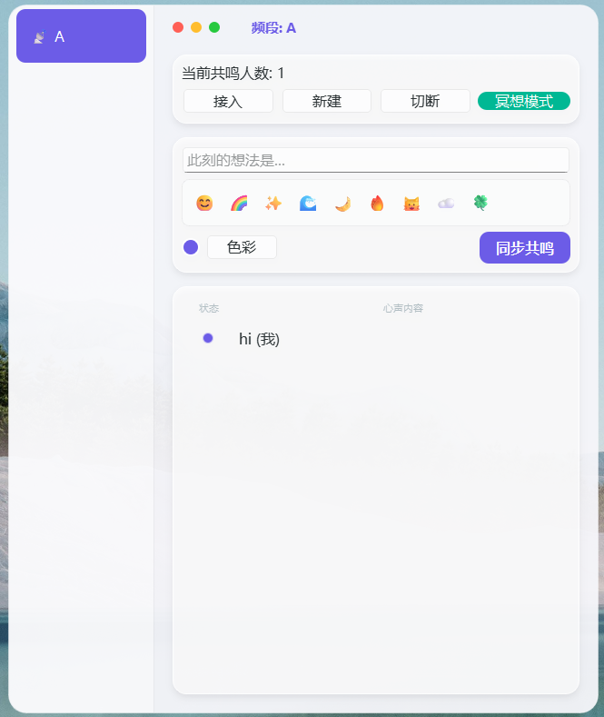

# ✨ 共鸣之光 (MoodBeam)

> **"在繁杂的世界里，寻找属于你的那一抹共鸣。"**

---

## 🌟 项目愿景 (Vision)

**共鸣之光 (MoodBeam)** 是一款专为办公室白领设计的**全匿名情绪连接工具**。

在压力巨大的工作间隙，你不需要复杂的社交，只需要通过一种颜色、一句话，在加密的小群组中与志同道合的人实现“情绪共振”。我们通过硬件底层识别技术，确保了真正的匿名性——无需注册，无需头像，只有最纯粹的心声。

---

## 🖼️ 界面预览 (Preview)

<!-- 应用预览 -->

  
  

*注：主界面左侧展示群组匿名色块，右侧展示实时心声*

---

## 🚀 核心功能 (Features)

| 功能模块 | 功能描述 | 状态 |
| :--- | :--- | :--- |
| **🎨 情绪色彩** | 自定义代表你当前心情的十六进制颜色 | ✅ 已实现 |
| **🔒 匿名群组** | 支持创建、加密加入、退出或解散专属群组 | ✅ 已实现 |
| **📡 实时同步** | 基于 Supabase 实时数据库，每 30 秒自动刷新共鸣列表 | ✅ 已实现 |
| **🛡️ 隐私保护** | 基于硬件 UUID (uuid.getnode) 识别，无账号体系，真正匿名 | ✅ 已实现 |
| **📥 托盘运行** | 最小化至系统托盘，不干扰工作，随时点击唤起 | ✅ 已实现 |

---

## 🛠️ 技术栈 (Tech Stack)

| 类别 | 技术方案 |
| :--- | :--- |
| **开发语言** | Python 3.9+ |
| **图形界面** | PyQt6 (高性能 Windows 原生体验) |
| **后端数据库** | Supabase (PostgreSQL + Realtime) |
| **打包工具** | PyInstaller |

---

## 📦 快速开始 (Getting Started)

### 对于普通用户 (直接运行)
1. 前往本仓库的 [Releases](https://github.com/immache/MoodBeam/releases/tag/v0.1.0) 页面。
2. 下载最新的 `MoodBeam.exe`。
3. 双击运行即可（若 Windows 提示安全风险，请点击“更多信息” -> “仍要运行”）。

### 对于开发者 (二次开发)
如果你想在本地运行源代码，请确保已安装 Python 3.9 环境：

| 步骤 | 命令 |
| :--- | :--- |
| 1. 克隆代码 | `git clone https://github.com/你的用户名/MoodBeam.git` |
| 2. 进入目录 | `cd MoodBeam` |
| 3. 安装依赖 | `pip install PyQt6 supabase` |
| 4. 运行程序 | `python main.py` |

---

## 📅 更新日志 (Changelog)

### v0.1.0 (2026-02-05)
- **[新增]** 正式群组管理系统（创建/加入/退出/解散）。
- **[优化]** 权限识别系统：只有创建者可以解散群组。
- **[提升]** UI 交互：集成 QTableWidget 实时展示群组成员状态。
- **[修复]** 修复了 Tray 图标在某些分辨率下模糊的问题。

### v0.2.0 (2026-02-05)
- **[美化]** 采用macOS界面设置。
- **[优化]** 可以快捷使用emoji表示状态。
- **[提升]** UI 交互：提供了更好的交互细节体验。
- **[修复]** 修复了状态栏相应失效的问题；修复了图标不显示的问题。

### v0.2.1 (2026-02-06)
- **[提升]** UI 交互：可以看到下次刷新时间；新增群组所有者可以删除群组的功能。
- **[修复]** 修复了一些bug。

---

## 🤝 参与贡献

如果你有任何好的想法，欢迎提交 **Issue** 或 **Pull Request**。

1. Fork 本项目
2. 创建你的特性分支 (`git checkout -b feature/AmazingFeature`)
3. 提交你的更改 (`git commit -m 'Add some AmazingFeature'`)
4. 推送到分支 (`git push origin feature/AmazingFeature`)
5. 开启一个 Pull Request

---

## 📄 许可证

本项目采用 MIT 许可证 - 详情请参阅 [LICENSE](LICENSE) 文件。

---

**💡 愿每一道光都能找到它的共鸣。**
